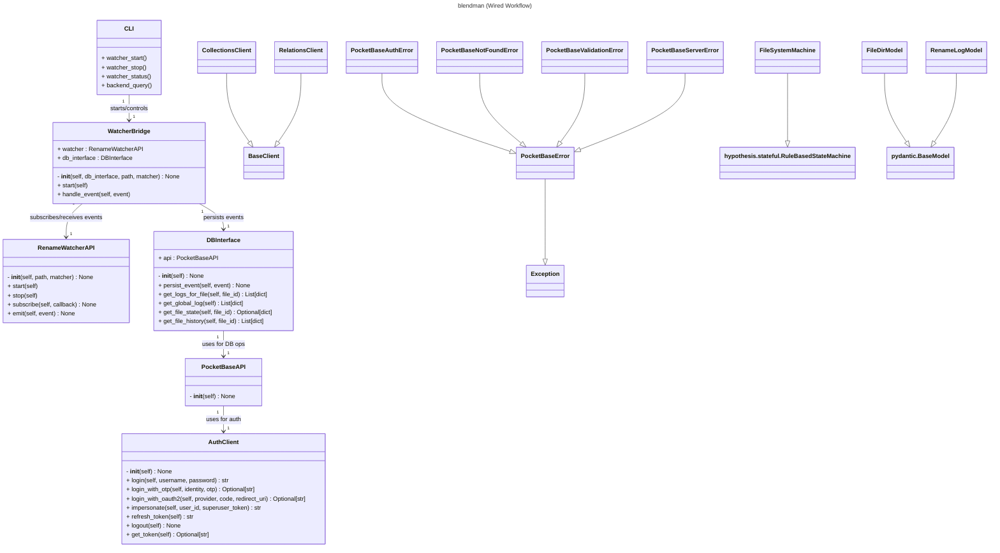

title: blendman
classDiagram

```mermaid
---
title: blendman (Wired Workflow)
---
classDiagram
    %% --- Workflow wiring ---
    CLI "1" --> "1" WatcherBridge : starts/controls
    WatcherBridge "1" --> "1" RenameWatcherAPI : subscribes/receives events
    WatcherBridge "1" --> "1" DBInterface : persists events
    DBInterface "1" --> "1" PocketBaseAPI : uses for DB ops
    PocketBaseAPI "1" --> "1" AuthClient : uses for auth

    class CLI {
        + watcher_start()
        + watcher_stop()
        + watcher_status()
        + backend_query()
    }

    class WatcherBridge {
        - __init__(self, db_interface, path, matcher) None
        + start(self)
        + handle_event(self, event)
        + watcher : RenameWatcherAPI
        + db_interface : DBInterface
    }

    class RenameWatcherAPI {
        - __init__(self, path, matcher) None
        + start(self)
        + stop(self)
        + subscribe(self, callback) None
        + emit(self, event) None
    }

    class DBInterface {
        - __init__(self) None
        + persist_event(self, event) None
        + get_logs_for_file(self, file_id) List[dict]
        + get_global_log(self) List[dict]
        + get_file_state(self, file_id) Optional[dict]
        + get_file_history(self, file_id) List[dict]
        + api : PocketBaseAPI
    }

    class PocketBaseAPI {
        - __init__(self) None
    }

    class AuthClient {
        - __init__(self) None
        + login(self, username, password) str
        + login_with_otp(self, identity, otp) Optional[str]
        + login_with_oauth2(self, provider, code, redirect_uri) Optional[str]
        + impersonate(self, user_id, superuser_token) str
        + refresh_token(self) str
        + logout(self) None
        + get_token(self) Optional[str]
    }

    %% --- Inheritance and base relationships ---
    CollectionsClient --|> BaseClient
    PocketBaseError --|> Exception
    PocketBaseAuthError --|> PocketBaseError
    PocketBaseNotFoundError --|> PocketBaseError
    PocketBaseValidationError --|> PocketBaseError
    PocketBaseServerError --|> PocketBaseError
    RelationsClient --|> BaseClient
    FileSystemMachine --|> `hypothesis.stateful.RuleBasedStateMachine`
    FileDirModel --|> `pydantic.BaseModel`
    RenameLogModel --|> `pydantic.BaseModel`

    %% --- Workflow note ---
    %% CLI → WatcherBridge → RenameWatcherAPI (emits event) → WatcherBridge.handle_event → DBInterface.persist_event → PocketBaseAPI
    %% All error cases are logged and surfaced at each layer.
```
