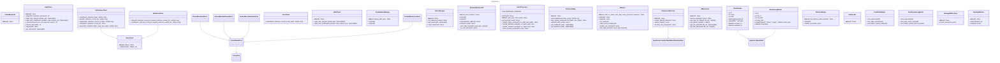

```mermaid
---
title: blendman
---
classDiagram
    class PocketBaseAPI {
        - __init__(self) None
    }

    class AuthClient {
        - __init__(self) None
        + login(self, username, password) str
        + login_with_otp(self, identity, otp) Optional[str]
        + login_with_oauth2(self, provider, code, redirect_uri) Optional[str]
        + impersonate(self, user_id, superuser_token) str
        + refresh_token(self) str
        + logout(self) None
        + get_token(self) Optional[str]
    }

    class BaseClient {
        - __init__(self, token) None
        - _headers(self) dict[str, str]
    }

    class CollectionsClient {
        + create(self, collection, data) dict[str, Any]
        + get(self, collection, record_id) dict[str, Any]
        + update(self, collection, record_id, data) dict[str, Any]
        + delete(self, collection, record_id) None
        + query(self, collection, filters, page, per_page) dict[str, Any]
    }

    class PocketBaseError

    class PocketBaseAuthError

    class PocketBaseNotFoundError

    class PocketBaseValidationError

    class PocketBaseServerError

    class FilesClient {
        + upload(self, collection, record_id, file_path) dict[str, Any]
    }

    class MFAClient {
        - __init__(self) None
        + login_with_otp(self, identity, otp) Optional[Dict]
        + login_with_oauth2(self, provider, code, redirect_uri) Optional[Dict]
    }

    class PocketBaseManager {
        - __init__(self, binary_path, port) None
        + start(self)
        + stop(self)
    }

    class RelationsClient {
        + link(self, collection, record_id, related_collection, related_id) dict[str, Any]
        + unlink(self, collection, record_id, related_collection, related_id) dict[str, Any]
    }

    class TokenManager {
        - __init__(self) None
        + set_token(self, token) None
        + get_token(self) Optional[str]
        + clear_token(self) None
    }

    class RenameWatcherAPI {
        - __init__(self, path, matcher) None
        + start(self)
        + stop(self)
        + subscribe(self, callback) None
        + emit(self, event) None
        - _emit_high_level(self, event_type, payload)
        - _on_raw_event(self, event)
    }

    class EventProcessor {
        + flush(self) None
        - __init__(self, path_map, emit_event) None
        + float DEBOUNCE_WINDOW
        + process(self, event) None
        - _handle_native_move(self, src_path, dest_path) None
        - _handle_deleted_event(self, src_path, now) bool
        - _handle_created_event(self, src_path, now) bool
        - _flush_pending_events(self, now) None
    }

    class PathInodeMap {
        - __init__(self) None
        + descendants(self, folder_path) Dict[str, int]
        + bulk_update_paths(self, old_folder, new_folder) None
        + add(self, path, inode) None
        + get_inode(self, path) Optional[int]
        + get_path(self, inode) Optional[str]
    }

    class Watcher {
        - __init__(self, path, on_event, path_map, event_processor, matcher) None
        + start(self) None
        + stop(self) None
        - _run_loop(self)
        - _make_event_handler(self)
        - _handle_raw_event(self, event)
        - _emit_high_level(self, event_type, payload)
    }

    class FileSystemMachine {
        - __init__(self) None
        + create_file(self, filename) None
        + delete_file(self) None
        + all_files_are_unique(self) None
    }

    class DBInterface {
        - __init__(self) None
        + persist_event(self, event) None
        + get_logs_for_file(self, file_id) List[dict]
        + get_global_log(self) List[dict]
        + get_file_state(self, file_id) Optional[dict]
        + get_file_history(self, file_id) List[dict]
    }

    class FileDirModel {
        + str id
        + str name
        + str path
        + Optional[str] parent_id
        + Literal["file", "dir"] type
        + datetime created_at
        + datetime updated_at
    }

    class RenameLogModel {
        + str id
        + str file_id
        + str old_path
        + str new_path
        + Literal["rename", "move", "create", "delete"] event_type
        + datetime timestamp
    }

    class WatcherBridge {
        - __init__(self, db_interface, path, matcher) None
        + start(self)
        + handle_event(self, event)
    }

    class DummyAPI {
        - __init__(self) None
    }

    class TestFileDirModel {
        + test_expected(self)
        + test_edge_unicode(self)
        + test_failure_missing_field(self)
    }

    class TestRenameLogModel {
        + test_expected(self)
        + test_edge_event_type(self)
        + test_failure_invalid_event_type(self)
    }

    class DummyDBInterface {
        - __init__(self) None
        + persist_event(self, event)
    }

    class DummyWatcher {
        - __init__(self) None
        + subscribe(self, cb)
        + emit(self, event)
    }

    CollectionsClient --|> BaseClient

    PocketBaseError --|> Exception

    PocketBaseAuthError --|> PocketBaseError

    PocketBaseNotFoundError --|> PocketBaseError

    PocketBaseValidationError --|> PocketBaseError

    PocketBaseServerError --|> PocketBaseError

    RelationsClient --|> BaseClient

    FileSystemMachine --|> `hypothesis.stateful.RuleBasedStateMachine`

    FileDirModel --|> `pydantic.BaseModel`

    RenameLogModel --|> `pydantic.BaseModel`
```
