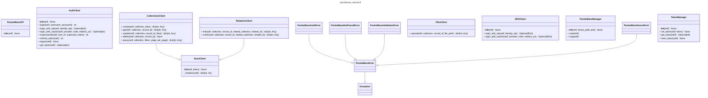

```mermaid
---
title: pocketbase_backend
---
classDiagram
    class PocketBaseAPI {
        - __init__(self) None
    }

    class AuthClient {
        - __init__(self) None
        + login(self, username, password) str
        + login_with_otp(self, identity, otp) Optional[str]
        + login_with_oauth2(self, provider, code, redirect_uri) Optional[str]
        + impersonate(self, user_id, superuser_token) str
        + refresh_token(self) str
        + logout(self) None
        + get_token(self) Optional[str]
    }

    class BaseClient {
        - __init__(self, token) None
        - _headers(self) dict[str, str]
    }

    class CollectionsClient {
        + create(self, collection, data) dict[str, Any]
        + get(self, collection, record_id) dict[str, Any]
        + update(self, collection, record_id, data) dict[str, Any]
        + delete(self, collection, record_id) None
        + query(self, collection, filters, page, per_page) dict[str, Any]
    }

    class PocketBaseError

    class PocketBaseAuthError

    class PocketBaseNotFoundError

    class PocketBaseValidationError

    class PocketBaseServerError

    class FilesClient {
        + upload(self, collection, record_id, file_path) dict[str, Any]
    }

    class MFAClient {
        - __init__(self) None
        + login_with_otp(self, identity, otp) Optional[Dict]
        + login_with_oauth2(self, provider, code, redirect_uri) Optional[Dict]
    }

    class PocketBaseManager {
        - __init__(self, binary_path, port) None
        + start(self)
        + stop(self)
    }

    class RelationsClient {
        + link(self, collection, record_id, related_collection, related_id) dict[str, Any]
        + unlink(self, collection, record_id, related_collection, related_id) dict[str, Any]
    }

    class TokenManager {
        - __init__(self) None
        + set_token(self, token) None
        + get_token(self) Optional[str]
        + clear_token(self) None
    }

    CollectionsClient --|> BaseClient

    PocketBaseError --|> Exception

    PocketBaseAuthError --|> PocketBaseError

    PocketBaseNotFoundError --|> PocketBaseError

    PocketBaseValidationError --|> PocketBaseError

    PocketBaseServerError --|> PocketBaseError

    RelationsClient --|> BaseClient
```
