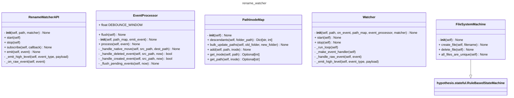

```mermaid
---
title: rename_watcher
---
classDiagram
    class RenameWatcherAPI {
        - __init__(self, path, matcher) None
        + start(self)
        + stop(self)
        + subscribe(self, callback) None
        + emit(self, event) None
        - _emit_high_level(self, event_type, payload)
        - _on_raw_event(self, event)
    }

    class EventProcessor {
        + flush(self) None
        - __init__(self, path_map, emit_event) None
        + float DEBOUNCE_WINDOW
        + process(self, event) None
        - _handle_native_move(self, src_path, dest_path) None
        - _handle_deleted_event(self, src_path, now) bool
        - _handle_created_event(self, src_path, now) bool
        - _flush_pending_events(self, now) None
    }

    class PathInodeMap {
        - __init__(self) None
        + descendants(self, folder_path) Dict[str, int]
        + bulk_update_paths(self, old_folder, new_folder) None
        + add(self, path, inode) None
        + get_inode(self, path) Optional[int]
        + get_path(self, inode) Optional[str]
    }

    class Watcher {
        - __init__(self, path, on_event, path_map, event_processor, matcher) None
        + start(self) None
        + stop(self) None
        - _run_loop(self)
        - _make_event_handler(self)
        - _handle_raw_event(self, event)
        - _emit_high_level(self, event_type, payload)
    }

    class FileSystemMachine {
        - __init__(self) None
        + create_file(self, filename) None
        + delete_file(self) None
        + all_files_are_unique(self) None
    }

    FileSystemMachine --|> `hypothesis.stateful.RuleBasedStateMachine`
```
